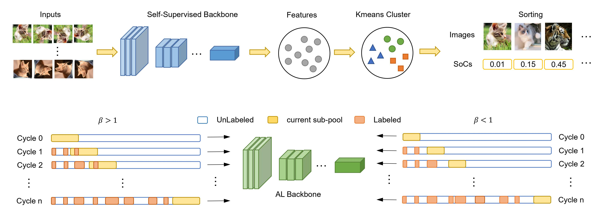
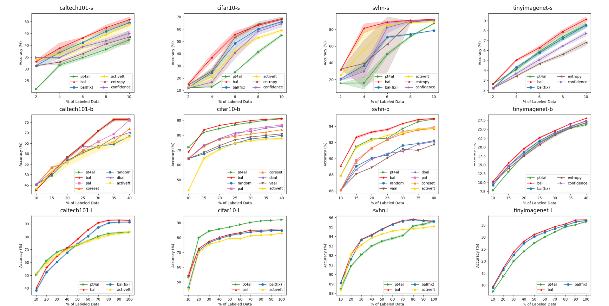

# BAL: Balancing Diversity and Novelty for Active Learning - Official Pytorch Implementation

Our [paper](https://ieeexplore.ieee.org/document/10372131/) has been accepted by TPAMI.

## Method


## Performance


## Experiment Setting
Install the requirements
```bash
pip install -r requirements.txt
```

Prepare the dataset in the following format
```
- DATA_PATH
    - DATASET
        - train
            - CLS
                - *.jpg
        - test
            - CLS
                - *.jpg
```
e.g.
```
- data
    - cifar10
        - train
            - 0 
                - airplane_3.jpg
                - airplane_10.jpg
                ...
            - 1 
            ...
            - 9
        - test
            - 0
            ...
            - 9
    - caltech101
        - train
        - test
    - svhn 
        - train
        - test
    ...
```

## Active Learning
1. To train the rotation predition task on the unlabeled set. This step will generate the ```SORTED_DATASET_PATH```.
```
python rotation.py \
    --save $SAVE \
    --net vgg16 \
    --dataset cifar10 \
    --datapath $DATA_PATH \
    --lr 0.1 \
    --batch_size 256
```

2. To kmeans cluster pretext features and sort the unlabeled pool. ```LOAD_DIR``` refers to your pretrained weights.
```
python kmeans.py \
    --net vgg16 \
    --dataset cifar10 \
    --datapath $DATA_PATH \
    --load $LOAD_DIR 
```

3. To train and evaluate on active learning task:
```
python main.py \
    --net vgg16 \
    --dataset cifar10 \
    --datapath $DATA_PATH \
    --per_samples_list 10 10 10 10 10 10 10 10 10 10 \ # change it according to your AL setting
    --addendum 5000 \                                  # change it according to your AL setting
    --save $SAVE \
    --beta 1.0 \
    --milestone 30 60 90 \
    --sort high2low \
    --sampling confidence \
    --first high1st \
    --lr 0.1 \
    --sorted_dataset_path $SORTED_DATASET_PATH
```

## Hyper-parameters

In our paper, we select the optimal ```beta`` by evaluating the results of the first epoch. You can directly utilize our experimental outcomes.

| Beta   | caltech101 | cifar10 | svhn | tinyimagenet |
|--------|------------|---------|------|--------------|
| small  | 0.5        | 1.0     | 1.0  | 0.5          |
| base   | 1.3        | 1.2     | 1.4  | 1.2          |
| large  | 2.5        | 2.0     | 2.0  | 2.5          |

## Citation
If you find our research helpful, kindly cite:
```
@ARTICLE{10372131,
  author={Li, Jingyao and Chen, Pengguang and Yu, Shaozuo and Liu, Shu and Jia, Jiaya},
  journal={IEEE Transactions on Pattern Analysis and Machine Intelligence}, 
  title={BAL: Balancing Diversity and Novelty for Active Learning}, 
  year={2023},
  volume={},
  number={},
  pages={1-12},
  doi={10.1109/TPAMI.2023.3345844}}
```

## Acknowledgement
Part of the code is modified from [PT4AL](https://github.com/johnsk95/PT4AL) repo.